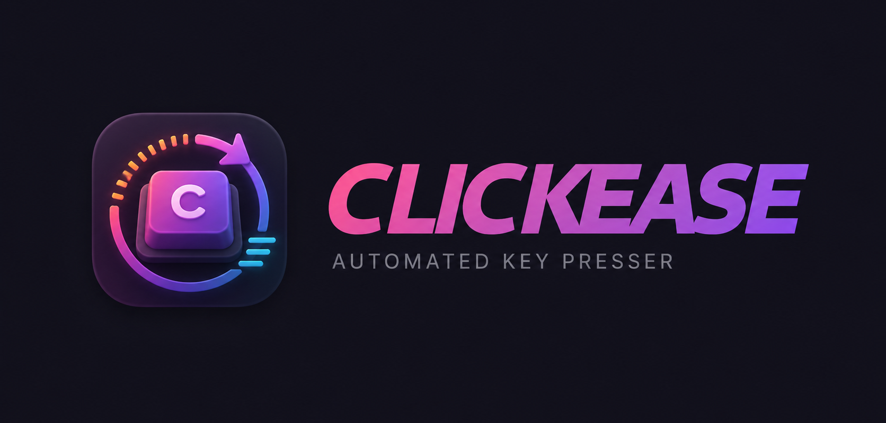
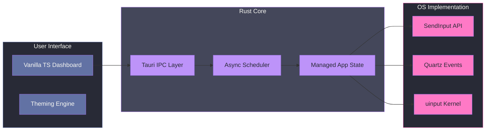

<div align="center">

<kbd></kbd>

[](https://github.com/scottdraper8/clickease/releases)
[](https://github.com/scottdraper8/clickease/actions/workflows/ci.yml)
[](https://www.rust-lang.org/)
[](https://pnpm.io/)
[](LICENSE)

<hr>

Clickease is a cross-platform desktop application designed to automate keyboard and mouse inputs.

<hr>

</div>

## Overview

Clickease abstracts complex operating system security models into a unified automation dashboard. It utilizes native system APIs to ensure high-fidelity input simulation that bypasses standard application-level restrictions.



<!-- Prettier keeps messing with this admonition -->

> [!IMPORTANT]
>
> **Privileged Access Required**: To ensure reliable input injection across all windows (including elevated ones), Clickease requires **Administrator** privileges on Windows and **Accessibility** permissions on macOS.

## Development

This project is built using **Tauri v2**. To begin development, ensure you have the Rust toolchain and Node.js environment configured.

> [!TIP]
>
> For developers on immutable Linux distributions (Bazzite, Fedora Silverblue), it is recommended to use a **Distrobox** container with the necessary system headers (`webkit2gtk`, `dbus-devel`) installed.

1. **Install Dependencies**:
   ```bash
   pnpm install
   ```
2. **Launch in Dev Mode**:
   ```bash
   pnpm tauri dev
   ```
