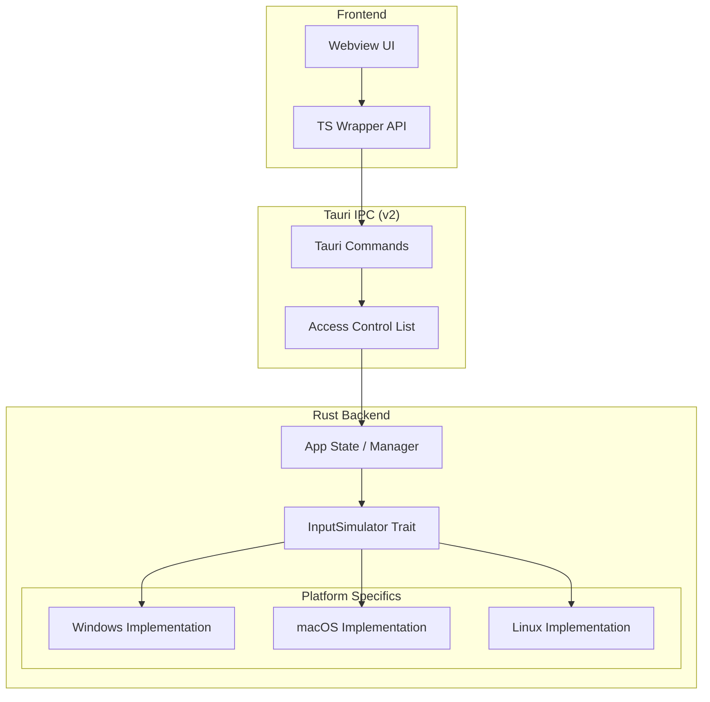

# Clickease Architecture Design

This document outlines the high-level architecture for Clickease, a cross-platform desktop application built with Tauri v2 and Rust, designed to send inputs to active windows.

## 1. High-Level Architecture

The system follows a classic Frontend-Backend separation, bridged by Tauri's IPC (Inter-Process Communication) layer.

### 1.1 Architectural Layers

| Layer                    | Responsibility                                                  | Technology                               |
| :----------------------- | :-------------------------------------------------------------- | :--------------------------------------- |
| **Frontend (UI)**        | User interface, state management for UI, calling commands.      | Vite + Vanilla TypeScript + Tailwind CSS |
| **IPC Layer**            | Type-safe communication bridge, permission enforcement (ACL).   | Tauri v2 Commands & Events               |
| **Backend Core**         | Business logic, input simulation management, state persistence. | Rust                                     |
| **Platform Abstraction** | Generic interface for OS-level operations.                      | Rust Traits                              |
| **OS Implementation**    | OS-specific code (Windows/macOS/Linux).                         | Rust + OS APIs / Specialized Crates      |

### 1.2 Component Diagram



---

## 2. IPC & Abstraction Strategy

### 2.1 Command Structure

Tauri v2 commands should be kept thin, acting only as entry points that delegate to a managed state.

```rust
#[tauri::command]
async fn simulate_click(
    state: tauri::State<'_, InputManager>,
    payload: MouseClickPayload
) -> Result<(), AppError> {
    state.simulator.click(payload).await
}
```

### 2.2 Input Abstraction (The `InputSimulator` Trait)

To keep the code maintainable and testable, all OS-specific input logic must be hidden behind a Rust trait.

```rust
pub trait InputSimulator: Send + Sync {
    fn type_text(&self, text: &str) -> Result<(), SimulatorError>;
    fn key_click(&self, key: KeyCode) -> Result<(), SimulatorError>;
    fn mouse_move(&self, x: i32, y: i32) -> Result<(), SimulatorError>;
    fn mouse_click(&self, button: MouseButton) -> Result<(), SimulatorError>;
}
```

---

## 3. Platform Specifics & Permissions

### 3.1 Windows: UIPI & Admin Privileges

Windows uses **User Interface Privilege Isolation (UIPI)** to prevent unelevated applications from sending inputs to elevated ones (e.g., Task Manager, Registry Editor).

**Proposed Strategies:**

1.  **Standard Mode (Unelevated):**
    - Works for most applications (Browsers, IDEs, Slack).
    - No special requirements.
2.  **Compatibility Mode (Run as Administrator):**
    - Requires a UAC prompt on launch.
    - Can send input to _all_ windows.
    - Can be enabled via `requestedExecutionLevel` in the manifest.
3.  **Accessibility Mode (`uiAccess="true"`):**
    - Allows an unelevated app to bypass UIPI.
    - **Requirements:**
      - Digital signature with a trusted certificate.
      - Installation in a secure directory (e.g., `C:\Program Files`).
    - **Recommendation:** This is the ideal production path for an "automation" tool like Clickease.

### 3.2 macOS: Accessibility API

On macOS, input simulation requires the **Accessibility** permission.

- The application must be added to _System Settings > Privacy & Security > Accessibility_.
- Tauri can detect if permissions are missing and prompt the user to open System Settings.

### 3.3 Linux: X11 vs. Wayland

- **X11:** Stable and well-supported via `libxtst`.
- **Wayland:** Security-first design blocks global input injection.
  - Requires `libei` (Emulated Input) or compositor-specific protocols (e.g., `wlr-virtual-pointer-unstable-v1`).
  - **Strategy:** Default to X11 support, provide experimental Wayland support where possible.

---

## 4. Security & Capabilities (Tauri v2)

Tauri v2 introduces a strict **Default-Deny** policy for IPC.

- **Permissions:** Every command must be explicitly enabled in `src-tauri/capabilities/default.json`.
- **Scoped Permissions:** We will design permissions that allow fine-grained control (e.g., `allow-keyboard-input` vs `allow-mouse-input`).

---

## 5. Summary of Technical Stack

- **Backend:** Rust (Tauri v2)
- **Input Injection:** `enigo` crate (or custom OS-level wrappers if fine-grained control is needed).
- **Frontend:** Vite + Vanilla TypeScript + Tailwind CSS.
- **State Management:** Rust `tauri::State` for global simulator lifecycle.
- **Validation:** Automated tests targeting the `InputSimulator` trait (using mocks).
